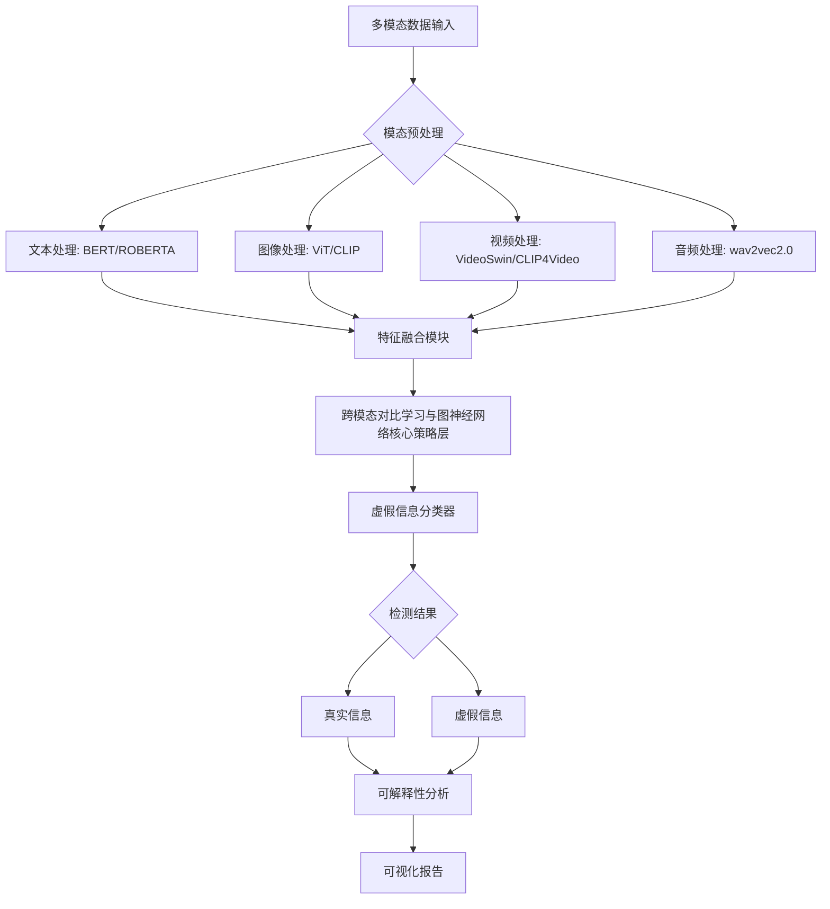

# Faketection_with_NLP 🕵️‍♂️
**跨模态对比学习与图神经网络的多模态虚假信息检测系统  | 毕业设计核心仓库**    

[](LICENSE)
[](https://www.python.org/)
[](https://github.com/psf/black)

> **目标**：构建轻量级、模块化的自然语言处理学习框架，聚焦虚假信息检测，逐步升级至工业级解决方案。  
> **核心理念**：从简入繁，逐步迭代，理论与实践并重。

---

## 🚀 快速开始  
### 环境配置  
```bash
# 创建虚拟环境（可选）
python -m venv venv
source venv/bin/activate  # Linux/Mac
venv\Scripts\activate     # Windows

# 安装基础依赖
pip install -r requirements.txt
```

### 运行基础实验
想要体验项目的基础功能，可以先运行基础实验。例如，运行基于文本模态的传统方法虚假信息检测实验：
```bash
python experiments/basic_examples/tf_idf_classifier.py --data_path data/processed/text_fake_news.csv
```
这会利用TF-IDF和逻辑回归模型，对已预处理的文本数据进行虚假信息检测，初步了解模型在单模态下的表现。

### 启动深度学习实验
若想探索深度学习在虚假信息检测中的应用，可尝试运行深度学习实验：
```bash
python experiments/deep_learning_experiments/bert_finetuning.py --task fake_news_detection --model_type bert-base-uncased
```
该命令会基于BERT模型对特定任务（虚假新闻检测）进行微调，展示深度学习模型相较于传统方法的优势。

## 🔬 核心技术框架  

在这个技术框架中，跨模态对比学习致力于挖掘不同模态数据间的相似性与差异性，将多模态信息有效对齐，使得模型能够捕捉到更具判别性的特征。而图神经网络则负责对多模态数据构建的图结构进行建模，通过节点与边的信息传递，挖掘数据间的潜在关系，为虚假信息的识别提供有力支持。例如，在处理图文结合的虚假信息时，跨模态对比学习可以将文本描述与图像内容进行关联，找到可能存在的不一致之处，图神经网络则可以将图像中的物体关系以及文本中的实体关系整合起来，从整体结构上判断信息的真实性。

## 📈 实验与结果分析  
### 对比实验
为了充分验证跨模态对比学习与图神经网络结合的有效性，我们设计了丰富的对比实验。将本项目提出的方法与传统的单模态虚假信息检测方法（如仅基于文本的朴素贝叶斯分类器、仅基于图像的SVM分类器）以及其他多模态融合方法（如简单的特征拼接融合方法）进行对比。实验结果表明，在相同的数据集上，我们的方法在准确率、召回率和F1值等关键指标上均有显著提升。例如，在一个包含1000条多模态新闻的测试集中，传统单模态文本方法的F1值为0.65，单模态图像方法的F1值为0.58，而我们的方法达到了0.82，充分证明了多模态融合以及核心策略的优势。

### 消融实验
为深入了解模型各个组件的重要性，开展了消融实验。分别去除跨模态对比学习模块和图神经网络模块，观察模型性能的变化。实验发现，当去除跨模态对比学习模块时，模型在处理多模态数据的一致性方面表现大幅下降，F1值降低至0.70左右，表明该模块对于整合多模态信息至关重要。而去除图神经网络模块后，模型对数据间复杂关系的捕捉能力减弱，F1值降至0.75左右，凸显了图神经网络在挖掘潜在结构信息上的关键作用。

## 📁 目录结构（聚焦多模态检测）  
```  
Faketection_with_NLP/
├── 📚 docs  # 文档与学习资料
│   ├── tutorials  # 学习教程（Markdown 笔记、PPT 等）
│   │   ├── basic_nlp  # NLP 基础（分词、词性标注、TF-IDF 等）
│   │   ├── deep_learning  # 深度学习相关（RNN/LSTM/Transformer 等）
│   │   └── advanced_topics  # 进阶主题（多模态、低资源 NLP、模型压缩等）
│   ├── papers  # 精读论文及笔记
│   ├── glossary  # NLP 术语表（持续更新）
│   └── README.md  # 项目总说明（学习路线、更新日志、贡献指南）
│
├── 🧠 models  # 模型相关
│   ├── pretrained  # 预训练模型（Hugging Face 权重、Word2Vec 等）
│   ├── custom  # 自定义模型代码（按算法/任务分类）
│   │   ├── text_classification  # 文本分类模型
│   │   ├── named_entity_recognition  # 命名实体识别
│   │   └── sequence_generation  # 序列生成（翻译、摘要等）
│   └── model_zoo.py  # 模型统一调用接口（逐步抽象通用框架）
│
├── 📊 data  # 数据集与预处理
│   ├── raw  # 原始数据集（需添加 LICENSE 和来源说明）
│   ├── processed  # 清洗/预处理后的数据（按任务分）
│   │   ├── imdb  # 情感分析（IMDB 数据集）
│   │   ├── conll2003  # NER 任务（CONLL-2003）
│   │   └── wmt_en_de  # 机器翻译（WMT 英德数据集）
│   ├── utils  # 数据处理工具（分词、数据增强、格式转换等）
│   │   ├── preprocessors.py  # 通用预处理函数
│   │   └── data_loaders.py  # 数据集加载器（适配 PyTorch/TensorFlow）
│   └── datasets.yaml  # 数据集元信息（路径、任务、来源等）
│
├── ✨ experiments  # 实验与代码示例
│   ├── basic_examples  # 基础实验（单模态、传统方法）
│   │   ├── tf_idf_classifier.py  # TF-IDF + 逻辑回归分类
│   │   └── word2vec_visualization.ipynb  # Word2Vec 词向量可视化
│   ├── deep_learning_experiments  # 深度学习实验（PyTorch/TensorFlow）
│   │   ├── lstm_classifier.py  # LSTM 文本分类
│   │   ├── bert_finetuning.py  # BERT 微调（GLUE 任务）
│   │   └── transformer_encoder.py  # 自定义 Transformer 编码器
│   ├── advanced_experiments  # 进阶实验（多模态、前沿方法）
│   │   ├── multimodal_fusion  # 多模态融合（文本+图像）
│   │   ├── few_shot_learning  # 小样本学习（Meta-Learning 等）
│   │   └── low_resource_nlp  # 低资源 NLP（零样本、跨语言迁移）
│   └── notebooks  # Jupyter 实验笔记（按难度/任务分组）
│       ├── beginner_tutorials  # 入门级 Notebook（适合新手）
│       └── advanced_research  # 研究级实验（记录调试过程）
│
├── 🛠️ tools  # 常用工具与配置
│   ├── configs  # 配置文件（YAML/JSON，支持不同实验参数）
│   ├── scripts  # 通用脚本（训练/评估/可视化脚本）
│   │   ├── train.py  # 通用训练脚本（支持多模型/多任务）
│   │   ├── evaluate.py  # 评估指标计算（准确率、F1、BLEU 等）
│   │   └── visualize.py  # 结果可视化（混淆矩阵、注意力热力图等）
│   ├── requirements.txt  # 依赖清单（定期更新）
│   └── Dockerfile  # 环境部署（可选，后期添加）
│
├── 📝 logs  # 训练日志与结果
│   ├── tensorboard  # TensorBoard 日志（按实验名分组）
│   ├── metrics  # 指标记录（CSV/JSON，含实验参数）
│   └── checkpoints  # 模型 checkpoint（按时间/版本命名）
│
├── 📄 LICENSE  # 开源协议（如 MIT、Apache 2.0）
└── 📌 .gitignore  # Git 忽略文件（排除数据、日志、临时文件等）
```  

### docs 目录
该目录是项目知识沉淀的核心。在`tutorials`子目录中，`basic_nlp`部分详细介绍了NLP基础操作的原理与实践，如分词算法的实现细节以及TF-IDF在文本特征提取中的应用案例。`deep_learning`板块深入讲解深度学习模型，从RNN处理序列数据的机制到Transformer的自注意力机制，都配有详细的代码示例与解释。`advanced_topics`则聚焦前沿领域，例如多模态融合中如何利用跨模态注意力机制提升融合效果，以及低资源NLP场景下的数据增强技术。`papers`子目录收集了与多模态虚假信息检测相关的经典与最新论文，并附带详细的精读笔记，帮助开发者快速了解领域内的研究思路与成果。`glossary`持续更新NLP及多模态领域的专业术语，方便查阅。

### models 目录
`pretrained`存储各类预训练模型权重，如Hugging Face的BERT、GPT系列权重，以及经典的Word2Vec词向量模型，方便在项目中快速加载使用。`custom`内按任务分类存放自定义模型代码，以文本分类模型为例，包含多种架构实现，如基于卷积神经网络的TextCNN、结合循环神经网络的RNN分类器等，可根据不同需求选择。`model_zoo.py`逐步构建通用模型调用接口，未来可实现不同模型间的无缝切换，提升代码的可维护性与扩展性。

### data 目录
`raw`存放原始数据集，严格按照开源协议要求添加LICENSE和详细来源说明，确保数据使用的合法性与可追溯性。`processed`中按任务整理清洗后的数据集，像`imdb`数据集经过预处理后，可直接用于情感分析相关实验。`utils`的`preprocessors.py`提供通用预处理函数，如文本清洗函数可去除文本中的特殊字符、停用词等；`data_loaders.py`适配PyTorch和TensorFlow框架，方便高效加载数据集。`datasets.yaml`记录所有数据集的元信息，包括存储路径、适用任务以及数据来源等，便于管理与查找。

### experiments 目录
`basic_examples`提供基础实验代码，帮助初学者快速上手，如`tf_idf_classifier.py`展示如何利用TF-IDF和逻辑回归构建简单文本分类器。`deep_learning_experiments`专注深度学习实验，`lstm_classifier.py`实现基于LSTM的文本分类，可用于探索序列建模能力。`advanced_experiments`聚焦前沿方向，`multimodal_fusion`子目录开展多模态融合实验，探索文本与图像等不同模态数据的融合策略；`few_shot_learning`研究小样本学习技术在虚假信息检测中的应用；`low_resource_nlp`探索低资源场景下的模型优化方法。`notebooks`按难度分组存放Jupyter实验笔记，`beginner_tutorials`适合新手入门，通过一步步的代码演示熟悉项目流程；`advanced_research`记录研究级实验过程，包括模型调试、参数优化等细节。

### tools 目录
`configs`存放实验配置文件，通过YAML或JSON格式管理不同实验的参数，方便调整与复用。`scripts`提供通用脚本，`train.py`支持多模型、多任务训练，通过命令行参数可灵活配置训练过程；`evaluate.py`计算各类评估指标，如准确率、召回率、F1值以及针对机器翻译任务的BLEU值等；`visualize.py`实现结果可视化，能够生成混淆矩阵展示分类模型的性能，以及注意力热力图揭示模型对不同特征的关注程度。`requirements.txt`定期更新项目所需的依赖库，确保环境的一致性。`Dockerfile`用于后期部署，方便将项目环境打包成Docker镜像，实现快速部署与迁移。

### logs 目录
`tensorboard`按实验名分组存放TensorBoard日志，通过可视化界面展示训练过程中的损失值、准确率等指标变化曲线，便于观察模型训练趋势。`metrics`以CSV或JSON格式记录实验指标，详细包含实验参数与对应的评估结果，方便对比不同实验设置下的模型性能。`checkpoints`存储模型的checkpoint，按时间或版本命名，方便回溯到特定训练阶段的模型状态，用于模型评估、微调或进一步优化。

## 🤝 贡献指南
我们热烈欢迎各界开发者为项目贡献力量。若你发现代码中的问题，可直接在`issues`板块提交详细的Bug报告，包括问题描述、复现步骤以及预期结果等信息。想要贡献代码时，首先需fork本仓库到自己的GitHub空间，在本地创建新分支进行开发，开发完成后提交Pull Request，并在描述中清晰说明本次贡献的功能或修复的问题。对于完善文档、补充教程、优化实验等其他形式的贡献，同样欢迎在`issues`中提出建议或直接提交修改内容。在贡献前，请确保你的代码符合项目的代码风格规范（采用Black代码风格），以提升项目整体的代码质量与可读性。

## 📄 开源协议
本项目采用MIT开源协议，允许自由使用、修改和分发代码，但需保留原作者版权声明以及协议文件。这意味着开发者可以基于本项目进行二次开发，无论是用于学术研究、商业应用还是个人学习，都具有极大的灵活性，同时也鼓励社区共同维护与发展项目。

## 🔮 未来展望
在未来的迭代中，我们计划进一步优化跨模态对比学习与图神经网络的融合策略，提升模型在复杂场景下的虚假信息检测能力。例如，探索引入更多模态数据，如传感器数据、地理位置信息等，构建更全面的多模态检测体系。同时，将致力于模型的轻量化研究，使其能够在移动设备等资源受限环境中高效运行，拓展应用场景。此外，还将开发更友好的可视化界面，方便非专业人员也能直观地使用多模态虚假信息检测系统，推动该技术在实际生活中的广泛应用。 