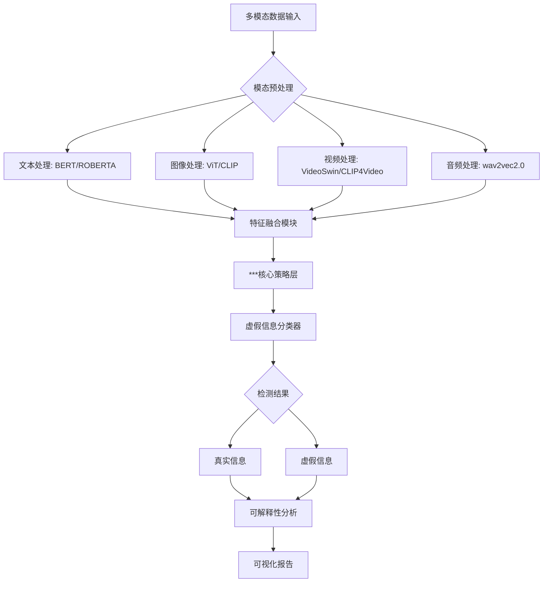

# 🕵️‍♂️ Multimodal-Fake-Info-Detector: 多模态虚假信息检测技术研究  
**基于***策略/方法的多模态虚假信息检测技术 | 毕业设计核心仓库**  

[](https://opensource.org/licenses/Apache-2.0)
[](https://www.python.org/)
[](https://github.com/yourname/obesity-policy-ai)


## 🌐 研究目标  
在社交媒体信息爆炸时代，虚假信息常以 **文本、图像、视频、音频** 等多模态形式传播，传统单模态检测方法难以应对复杂场景。本项目构建 **“模态特征解耦-跨模态关联建模-虚假模式挖掘”** 技术框架，实现：  
- **多模态数据融合**：打破模态壁垒，设计高效特征融合策略（如早期融合/晚期融合/分层融合）  
- **虚假模式识别**：基于***核心方法（如GNN图推理、对比学习、强化学习决策），捕捉跨模态不一致性  
- **鲁棒性检测**：对抗样本防御、低资源场景泛化、长尾虚假类型覆盖  


## 🔬 核心技术框架  



## 📁 目录结构（聚焦多模态检测）  
```  
Multimodal-Fake-Info-Detector/  
├── 📚 docs                # 学术文档与项目说明  
│   ├── thesis/            # 毕业设计相关  
│   │   ├── literature_review/   # 文献综述（含经典论文精读）  
│   │   ├── methodology/      # 核心方法推导（公式/架构图）  
│   │   ├── experiment_design/  # 实验方案（数据集/评估指标）  
│   │   └── results_analysis/   # 结果分析（图表/对比实验）  
│   ├── datasets/          # 数据集说明（来源/预处理流程）  
│   ├── models/            # 模型架构文档（含核心代码注释）  
│   └── README.md          # 当前文档（项目总览）  
│  
├── 📊 data                # 多模态数据集  
│   ├── raw/               # 原始数据（按模态分类）  
│   │   ├── text/          # 文本数据（JSON/CSV格式，含标签）  
│   │   ├── images/        # 图像数据（JPEG/PNG，标注元数据）  
│   │   ├── videos/        # 视频片段（MP4，关键帧提取记录）  
│   │   └── audios/        # 音频文件（WAV，语音转文本结果）  
│   ├── processed/         # 预处理后数据  
│   │   ├── feature_embeddings/  # 模态特征向量（.npy/.pt文件）  
│   │   └── fused_data/    # 融合后数据集（用于模型训练）  
│   └── utils/             # 数据处理工具  
│       ├── preprocessors/  # 各模态预处理脚本（文本清洗/图像resize）  
│       └── dataloaders.py  # 多模态数据加载器（支持批次混合）  
│  
├── 🧠 models              # 检测模型核心  
│   ├── unimodal/          # 单模态基础模型  
│   │   ├── text_classifier/  # 文本编码器（BERT微调）  
│   │   └── image_encoder/   # 图像特征提取（ViT/CLIP）  
│   ├── fusion_strategies/ # 多模态融合模块  
│   │   ├── early_fusion/    # 输入层融合（拼接/加权求和）  
│   │   ├── late_fusion/     # 决策层融合（投票机制/门控网络）  
│   │   └── ***_strategy/    # 核心策略实现（如GNN图融合/对比学习对齐）  
│   └── detectors/         # 虚假信息检测器  
│       ├── classifier.py   # 分类头（支持多标签/二分类）  
│       └── explainability/  # 可解释性工具（注意力可视化/反事实分析）  
│  
├── ✨ experiments         # 实验与复现  
│   ├── baseline/          # 基准实验（单模态/传统方法）  
│   │   ├── text_only.py   # 仅文本检测（逻辑回归/TextCNN）  
│   │   └── image_only.py  # 仅图像检测（CNN+分类器）  
│   ├── core_method/       # 核心策略实验  
│   │   ├── ***_fusion_experiment.py  # 核心方法主脚本  
│   │   └── ablation_study/   # 消融实验（验证各模块重要性）  
│   └── evaluation/        # 评估与可视化  
│       ├── metrics.py     # 指标计算（F1/AUC-ROC/准确率）  
│       └── visualizer.py  # 结果可视化（混淆矩阵/热力图）  
│  
├── 🛠️ tools               # 工程化工具  
│   ├── configs/           # 实验配置（YAML参数文件）  
│   │   ├── dataset.yaml   # 数据集路径配置  
│   │   └── model.yaml     # 模型超参数配置  
│   ├── scripts/           # 通用脚本（一键运行）  
│   │   ├── train.py       # 训练入口（支持多GPU分布式训练）  
│   │   └── test.py        # 测试与推理脚本  
│   └── requirements.txt   # 依赖清单（含PyTorch/TensorFlow等）  
│  
├── 📝 logs                # 实验记录  
│   ├── checkpoints/       # 模型权重（按epoch/指标命名）  
│   ├── tensorboard/       # 训练曲线（loss/准确率可视化）  
│   └── results/           # 实验结果表格（含对比数据）  
│  
├── 📄 LICENSE             # 开源协议  
└── .gitignore             # 版本控制忽略文件  
```  


## 🚀 快速启动：毕业设计实验流程  
### 1. 数据准备  
```bash  
# 下载基准数据集（如Multimedia Fake News Dataset）  
cd data/raw  
wget https://example.com/multimodal_fake_news.zip  
unzip multimodal_fake_news.zip  
```  

### 2. 环境配置  
```bash  
# 创建虚拟环境  
conda create -n fake_info_detector python=3.9  
conda activate fake_info_detector  
# 安装依赖  
pip install -r tools/requirements.txt  
```  

### 3. 运行核心实验  
```bash  
# 单卡训练（基于***策略的多模态融合模型）  
python tools/scripts/train.py --config configs/***/core_strategy.yaml  
# 多卡分布式训练（8卡）  
python -m torch.distributed.launch --nproc_per_node=8 tools/scripts/train.py --distributed  
```  

### 4. 结果分析  
```bash  
# 生成评估报告  
python experiments/evaluation/metrics.py --result_path logs/results/latest.csv  
# 可视化跨模态注意力矩阵  
python experiments/evaluation/visualizer.py --model_path logs/checkpoints/best_model.pth  
```  


## 🌟 项目特色（学术向）  
1. **方法论聚焦**  
   - 围绕 **“***策略/方法”** 深度优化，所有模块（数据预处理、特征融合、分类器设计）均服务于核心假设验证  
   - 理论推导与代码实现强关联，如 `docs/methodology/` 中公式对应 `models/fusion_strategies/***/` 代码逻辑  

2. **实验严谨性**  
   - 包含 **基准对比实验**（单模态vs多模态、传统方法vs深度学习）、**消融实验**（验证各模态贡献度）、**鲁棒性测试**（对抗样本攻击实验）  
   - 结果记录遵循学术规范，`logs/results/` 包含完整超参数、训练日志、统计检验值（如t检验/p值）  

3. **可复现性保障**  
   - 所有实验参数可通过 `configs/` 目录YAML文件复现，支持 `Hydra` 配置管理  
   - 数据集预处理脚本附带详细注释，确保原始数据到输入特征的处理流程可追溯  


## 📑 毕业设计配套材料  
- **文档结构**：`docs/thesis/` 目录可直接映射毕业设计章节  
  - `literature_review/` → 文献综述章节  
  - `methodology/` → 方法论与模型架构章节  
  - `experiment_design/` + `results_analysis/` → 实验与结果章节  
- **代码演示**：`experiments/core_method/` 脚本可作为答辩演示代码，配合 `visualizer.py` 生成汇报用图表  


## 🤝 协作与反馈  
适合作为毕业设计单人仓库，若需团队协作：  
- `docs/分工表.md` 记录各模块负责人（如数据组/模型组/可视化组）  
- `issues` 追踪毕设进度（标注“实验复现”“论文撰写”“PPT制作”等标签）  


## 📄 版权声明  
本项目为 **学术研究用途**，代码与文档遵循 **MIT License**，引用时请注明：  
```  
@software{Multimodal-Fake-Info-Detector,  
  title = {基于***策略/方法的多模态虚假信息检测技术},  
  author = {Your Name},  
  year = {2025},  
  url = {https://github.com/your-username/Multimodal-Fake-Info-Detector}  
}  
```  


## 🔮 未来工作（毕设扩展方向）  
- 引入 **视频时序分析** 与 **音频情感识别**，构建全模态检测框架  
- 探索 **小样本场景下的虚假信息检测**，结合元学习（Meta-Learning）技术  
- 开发 **实时检测API**，支持社交媒体平台接入（可作为毕设创新点）  


**让多模态数据成为虚假信息的“照妖镜”！** 🔍  

  


### 使用说明  
1. 将仓库名称改为 `Multimodal-Fake-Info-Detector`（或包含你的核心方法名称，如 `Graph-Based-Multimodal-Fake-News-Detector`）  
2. `***` 替换为你的具体策略/方法（如“图神经网络”“对比学习”“强化学习决策”）  
3. 根据实际研究内容，在 `models/fusion_strategies/` 和 `experiments/core_method/` 中补充核心代码  


此结构既符合学术规范，又便于毕设答辩展示，后续可直接扩展为期刊论文或工业级检测系统的原型。需要进一步细化某个模块（如数据预处理代码、模型架构图）可以随时告诉我！